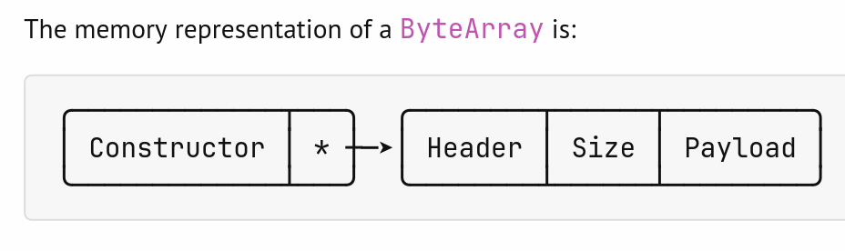
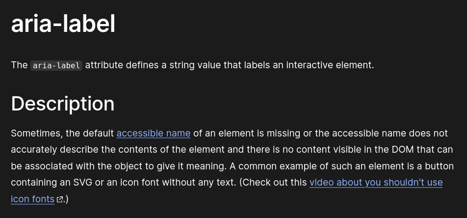
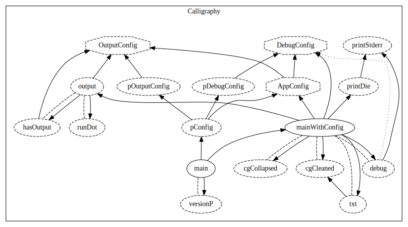
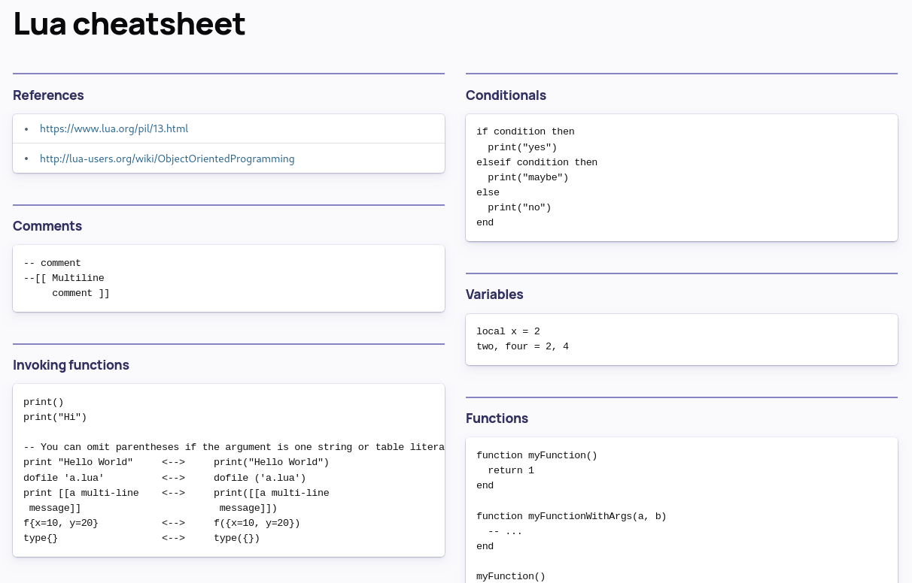
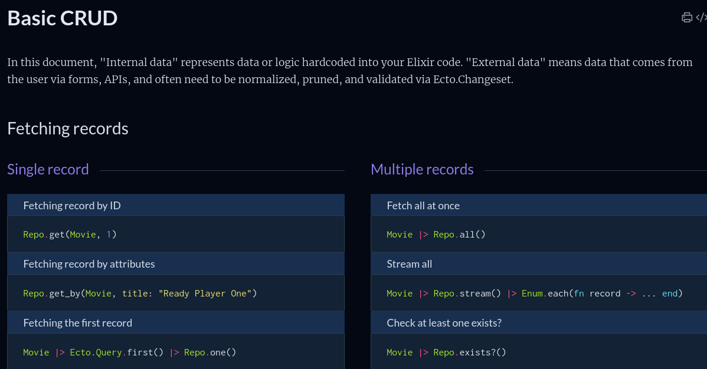
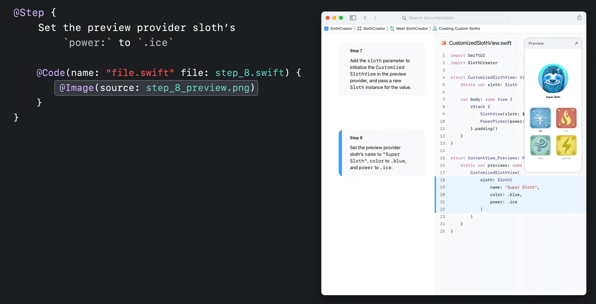

---
css:
  - ./assets/css/variables.css
  - ./assets/css/styles.css
title: Haskell and its documentation
subtitle:
introductory_notes: |
  Welcome everyone,
  this talk will be about Haddock, the documentation generation tool, its recent past,
  and the future that is being collectively built for it.
light: true
#ratio43: true
overlay: Haskell Ecosystem Workshop 2024
author:
  - name: Hécate
    desc:
      - Software Engineer / PM at Scrive </br> <span class="big-2">&</span>
      - Helping hand at the Haskell Foundation

---

# Follow the presentation

:::jumbogroup

:::

---

# Structure of this talk

* Haskell Documentation Team
* The Peregrinations of Haddock until today
* Born to be a tortured poet, forced to write markup
* Interlude: Documentation is a Discipline
* The Immediate Future of Haddock
* This isn't even Haddock's final form

---

# Haskell Documentation Team

## We write the documentation
## We design the tools of documentation
## We promote the culture of documentation

---

# The Peregrinations of Haddock

---

## It all began in the year 2002…

::: notes
In 2002, Simon Marlow started Haddock.
:::

```
[haddock @ 2002-04-04 16:23:43 by simonmar]
This is Haddock, my stab at a Haskell documentation tool.  It's not
quite ready for release yet, but I'm putting it in the repository so
others can take a look.
It uses a locally modified version of the hssource parser, extended
with support for GHC extensions and documentation annotations.

├── html
│   └── haddock.css
├── LICENSE
├── Makefile
├── mk
│   ├── boilerplate.mk
│   ├── config.mk
│   ├── target.mk
│   └── version.mk
├── README
├── src
│   ├── HaddockDB.hs
│   ├── HaddockHtml.hs
│   ├── HaddockLex.hs
│   ├── HaddockTypes.hs
│   ├── HaddockVersion.hs
│   ├── HsLexer.lhs
│   ├── HsParseMonad.lhs
│   ├── HsParser.ly
│   ├── HsParseUtils.lhs
│   ├── HsSyn.lhs
│   ├── Main.hs
│   └── Makefile
└── TODO
```

---

## Let's take a look at the code in 2002

```
-------------------------------------------------------------------------------
Language                     files          blank        comment           code
-------------------------------------------------------------------------------
Haskell                         10            463            264           2084
CSS                              1             15              0             96
make                             6             23             37             32
-------------------------------------------------------------------------------
SUM:                            17            501            301           2212
```

---

## In 2024, we have a bit more code…

```
-------------------------------------------------------------------------------
Language                     files          blank        comment           code
-------------------------------------------------------------------------------
Haskell                         55           2625           2822          16308
JSON                             3              0              0          10408
CSS                              5            451            101           1819
TypeScript                       5            128            122            820
JavaScript                       4              7              2             50
Markdown                         3             28              0             43
TeX                              1             13             18             26
-------------------------------------------------------------------------------
SUM:                            76           3252           3065          29474
```

---

::: notes
Synchronisation workflow during development was tedious
Some GHC bindists were published with an innapropriate submodule commit
:::

## It moved around quite a bit

### In 2014
* Calls to split it from GHC's repository
* Found a home on GitHub
* Used within GHC through a *git submodule* of a *mirror on the Gitlab*

### In 2024
* Calls for reintegration in GHC's repository
* No more synchronisation problems
* Feedback loop is improved for GHC contributors
* Haddock previews in Gitlab CI (🫶 Teo Camarasu)

---

# Born to be a tortured poet, forced to write markup

::: notes
Now I'm going to talk about some problematic stuff within Haddock,
which is important, in order to understand what are the opportunities for
improvement.
:::

---

::: notes
We can't slap you on the wrist if you end up producing more than one `<h1>` tags in your documentation.
More generally, the h1 > h2 > h3 cannot really be enforced.
:::

## Semantic blindness

:::jumbogroup

:::

---

## Accessible diagrams

### We love ASCII art & Unicode diagrams

* More lightweight to distribute than images
* Unicode has box drawing symbols, gotta use them!



---

## Accessible diagrams

### We love ASCII art & Unicode diagrams

… But screen readers don't love them as much


© Sonmez Karakurt

::: notes
  The diagrams are going to be extremely confusing because
  screen readers will spell each single characters.
  Imagine suddenly you hear: "Box Drawings Light Arc Down and Right", "Box Drawings Light Horizontal", etc etc.
:::

---

## Accessible diagrams



---

::: notes
  Some of you will see th mistake I made when writing down the characters that make
  up this table. Those of you who didn't will be told in the most cryptic way.
:::

## Cumbersome table syntax

```
-- | This is a grid table:
--
-- +------------------------+------------+----------+----------+
-- | Header row, column 1   | Header 2   | Header 3 | Header 4 |
-- +======================+============+==========+==========+
-- | body row 1, column 1   | column 2   | column 3 | column 4|
-- +----------------------+------------+----------+----------+
-- | body row 1, column 1   | column 2   | column 3 | column 4|
-- +----------------------+------------+----------+----------+
module Main where
```

---

## Cumbersome table syntax

```haskell
  <no location info>: error:
Data.Text.Internal.Fusion.Common.index: Index too large

CallStack (from HasCallStack):
  error, called at libraries/text/src/Data/Text/Internal/Fusion/Common.hs:1189:24 in text-2.0.2:Data.Text.Internal.Fusion.Common
  streamError, called at libraries/text/src/Data/Text/Internal/Fusion/Common.hs:1089:33 in text-2.0.2:Data.Text.Internal.Fusion.Common
  indexI, called at libraries/text/src/Data/Text/Internal/Fusion.hs:249:9 in text-2.0.2:Data.Text.Internal.Fusion
  index, called at libraries/text/src/Data/Text.hs:1951:13 in text-2.0.2:Data.Text
  index, called at utils/haddock/haddock-library/src/Documentation/Haddock/Parser.hs:464:17 in haddock-2.29.2:Documentation.Haddock.Parser
```


---

::: notes
Silent and counter-intuitive behaviours: I really love when my tables don't get rendered because they
are at the top of a module's documentation.
Automatic link checking: HTTP 404s, missing files on disk
:::

## What people usually wish for

* No more silent *and* counter-intuitive behaviours
* Syntax highlighting in code blocks and lines
* Automatic check of broken links
* Automatic `@since` annotations

---

# Interlude: Documentation is a Discipline

::: notes
Documentation is a discipline for which we are given tools,
both conceptual and concrete. Let's examine some of them.
:::

---

::: notes
Write down initial ideas, user needs, the ideal documentation that you'd like users to read.
Survey potential on the ergonomics and features.
Take notes of ideas that you rejected and *why*, so that people understand the trajectory
Confront your documentation to the world, fill the gaps
:::


## We never stop documenting
* Initial ideas, ideal user manual
* Survey users
* Write a commentary (or explanation)
* Iterate

---

:::notes
Understand the stability of your documentation.
:::

## Volatile Documentation, Stable Documentation

### Some documentation is stable
* A README without code
* A vision statement
* The value proposition and core domain

---

::: notes
As opposed to the stable documentation, you will have to use some specialised
tools to ensure that volatile documentation stays relevant at all times
:::

## Volatile Documentation, Stable Documentation

### Some documentation is stable
* A README without code
* A vision statement
* The value proposition and core domain

### Some documentation is volatile
* Documentation generated at runtime
* Code examples
* Tests
* Configuration

---

## Volatile Documentation, Stable Documentation

> “When you refer to something, make sure the direction of the reference is from the more volatile to the more stable elements”

— Cyrille Martraire, Living Documentation, 2019

---

## Volatile Documentation, Stable Documentation

(*Simplified model*)

<pre style="font-size:x-large;">
Haddocks of a third-party library
├──> Official specs
├──> Architecture Document
└─┬> Haddocks of a core library (base, text, vector, etc)
  ├──> GHC Manual
  ├──> Official specs
  └──> Papers (without paywalls)
</pre>

---

::: notes
Diátaxis is an empirical documentation model crafted around the
needs of documentation users. It uses four quadrant, which represent
a pairing of action (up), cognition (down), acquisition (left) and application (right).
:::

## Understand for whom you write

### Diátaxis Framework, by Daniele Procida


---

::: notes
Expose the relationships between the components of your software.
Calligraphy is a call graph visualizer that works with HIE files.
You can have it show or hide modules, classes, types, function calls.
:::

## Expose the relationships between components

### Calligraphy, by Jonas Carpay




---

# The Immediate Future of Haddock

---

## Code base clean-up

### We are in a continuous process of tidying up the code base to make change easier

> “for each desired change, make the change easy (warning: this may be hard), then make the easy change”

– Kent Beck


---

## Improving the reliability of each new release

* Integration within GHC's processes and infrastructure
* QA effort to make sure that user-visible changes don't accidentally break other things

---

::: notes
We collaborated with Chris Done to make `lucid2` appropriate for generating HTML5 (HPC will also benefit from this).
We will collaborate with UI developers to provide an optimal experience on mobile devices,
provide extension points in the design, and improve the ergonomics with edge cases.

Edge cases: freakishly huge type signatures
:::

## Modern Web Documents

* HTML5

* CSS3

* Accessibility

* Maintainability

---

# This isn't even Haddock's final form

---

## Support for Guides

* We want to liberate ourselves from the Reference's point of view
  * Prose must be supported as a first-class citizen

---

## Support for Sandboxed Interactive Execution

* We could provide runnable code snippets that could get executed from within the generated document
  * The Haskell Playground could back this feature

---

## Support for Cheatsheets

### Lua



---

## Support for Cheatsheets

### Elixir



---

::: notes
We want to have metaprogramming, in order to get an extensible system.
Traversal of the document to produce backward and forward references.
(Sebastian, you and I are going to talk :)
:::

## An Extensible Authoring Tool

### Genres of documentation

* Today: 1 type of documentation (Module reference)
* Tomorrow: *n* types of documents (Module reference, Article, Book, Brochure)

---

::: notes
Bring your own syntax! Mermaid diagrams have been growing in popularity these past years.
GHC Notes also are a fantastic treasure trove of knowledge. They should be indexed
and easily reachable.
:::

## An Extensible Authoring Tool

### Pluggable Syntax Plugins!

* Mermaid diagrams
* AsciiMath
* GHC Notes
* Rendering a JSON structure queried at Haddock's run-time

---

### Pluggable Syntax Plugins!

Interactive tutorials with side-by-side steps, and highlighted code.
(Swift's DocC)



---

### What could Haddock 3 look like?

```haskell
module Manual where

import Haddock.Genre.Manual (manual)
import My.Module (ident)
main = [manual|
---
title = "My fantastic document" -- Mandatory metadata
author = "The Document Team"
---

# Relative top-level header
---
id = top-level -- Section metadata, user-provided, guaranteed to be globally unique
---

## Relative second level header

Link to an in-scope identifier with `{ref ident}`.
Link to an out-of-scope identifier with `{ref Manual.Chapter2.chapter2}`
Print an in-scope identifier in a human-readable way {ident}. `This is inline code`

The entry point of the package is: {ref sendMissiles}
{docstring sendMissiles}
|]
```
---

### What could Haddock 3 look like?

```haskell
module Manual where

import Haddock.Genre.Manual (manual)
import Haddock.Syntax.Mermaid (mermaid)

main = [manual|
---
title = "Architecture Diagram" -- Mandatory metadata
---

```mermaid
flowchart TD
    node_0[Documentation.Haddock.Types]
    node_100[Documentation.Haddock.Parser.Monad]
    node_127[Documentation.Haddock.Parser.Util]
    node_138[Documentation.Haddock.Parser.Identifier]
    node_100 --> node_0
    node_127 --> node_100
    node_138 --> node_0
    […]
```​
|]

```

---

## An Extensible Authoring Tool

### Pluggable Backend Plugins!

* EPUB3
* Typst
* Roff manual page format
* Docset for Zeal or DashApp

---

## An Extensible Authoring Tool

### Inspirations

* Racket ~> Scribble
* Lean4 ~> Verso
* Elixir ~> ExDoc
* Rust ~> rustdoc

---

::: notes
Quality Assurance: If you have a Windows or macOS computer, we're interested!
Release engineering: Ticket triaging, nightly releases, benchmarks CI!
:::

## Thank you very much

* Create your Haskell Gitlab account today!
* Join us at `#ghc:matrix.org` & `#haddock:matrix.org`
* We need people for:
  * Tidying up
  * Quality Assurance
  * Release Engineering

---

# Sources

* _Diátaxis documentation framework_, Daniele Procida, [diataxis.fr](https://diataxis.fr)
* _Living Documentation_ by Cyrille Martraire

# (more) Sources

* <https://devhints.io/lua>
* <https://docs.racket-lang.org/scribble/>
* <https://github.com/haskell/haddock/commit/2b39cd941c80d2603f2480684c45dd31f9256831>
* <https://github.com/jonascarpay/calligraphy>
* <https://github.com/leanprover/verso>
* <https://hexdocs.pm/ecto/crud.html>
* <https://mail.haskell.org/pipermail/ghc-devs/2024-May/021635.html>
* <https://www.swift.org/documentation/docc/>
* <https://zealdocs.org/>
